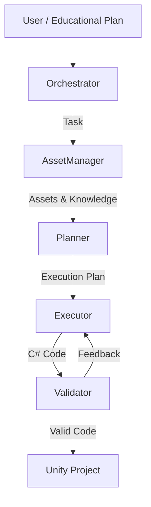

# Xage 🌌

**Xage** (XR Agentic Generation Engine) is an autonomous multi-agent system designed to accelerate XR development. It acts as an **AI-powered XR Developer**, capable of taking a high-level "Educational Plan" and turning it into functional, validated C# code for Unity.

By orchestrating a team of specialized AI agents, Xage automates the tedious parts of XR content creation—from asset retrieval to logic implementation—allowing creators to focus on the experience itself.

---

## 🚀 Features

- **🤖 Multi-Agent Architecture**: A coordinated team of agents (Orchestrator, Planner, Executor, Asset Manager) working in tandem.
- **🧠 Context-Aware Generation**: Uses a Knowledge Graph (Neo4j) to understand interaction rules and best practices.
- **📦 Asset Integration**: Automatically searches and retrieves 3D assets from Sketchfab.
- **🎮 Unity Bridge**: Generates, compiles, and validates C# scripts directly for Unity projects.
- **📝 Educational Plan Parsing**: Converts structured pedagogical requirements into executable technical tasks.
- **🛡️ Code Validation**: Includes a Roslyn-based validator to ensure generated code is syntactically correct and follows project conventions.

---

## 🏗️ Architecture

Xage is built on **LangChain** and **LangGraph**, simulating a software development team:



### The Agents
1.  **Orchestrator**: The project manager. It parses the Educational Plan, tracks progress, and assigns tasks.
2.  **Asset Manager**: The resource gatherer. It queries **Neo4j** for implementation details and searches **Sketchfab** for 3D models.
3.  **Planner**: The architect. It creates a step-by-step technical execution plan based on the task and available assets.
4.  **Executor**: The coder. It writes the actual C# Unity scripts.
5.  **Validator**: The QA. It checks the code for errors using a custom Roslyn tool and requests fixes if needed.

---

## 🛠️ Getting Started

### Prerequisites
- **Python 3.11+**
- **Ollama**: For local LLM inference (e.g., `llama3.1`).
- **Neo4j**: For the knowledge graph.
- **Unity**: (Optional) To see the generated scripts in action.

### Installation

1.  **Clone the repository:**
    ```bash
    git clone https://github.com/yourusername/Xage.git
    cd Xage
    ```

2.  **Create a virtual environment:**
    ```bash
    python -m venv venv
    source venv/bin/activate  # On Windows: venv\Scripts\activate
    ```

3.  **Install dependencies:**
    ```bash
    pip install -r requirements.txt
    ```

4.  **Set up configuration:**
    Copy `.env.example` (if available) or create a `.env` file with your keys:
    ```ini
    # LLM Configuration
    OLLAMA_BASE_URL=http://localhost:11434
    
    # Sketchfab (Required for Asset Manager)
    SKETCHFAB_API_TOKEN=your_sketchfab_token
    
    # Neo4j (Required for Knowledge Graph)
    NEO4J_URI=bolt://localhost:7687
    NEO4J_USERNAME=neo4j
    NEO4J_PASSWORD=your_password
    ```

---

## 🏃 Usage

### 1. Seed the Knowledge Graph
Before running the agents, populate your local Neo4j instance with the base knowledge:
```bash
python -m scripts.seed_neo4j
```

### 2. Run the System
To run the main agentic workflow (MVP v2) which processes a sample Educational Plan:
```bash
python src/main.py
```

*Note: `src/main.py` contains the entry point for the graph workflow.*

### 3. Configuration Options

**Sketchfab Settings:**
- `SKETCHFAB_MODEL_NAME`: Fallback query string.
- `SKETCHFAB_MAX_RESULTS`: Max results per search (default: `10`).
- `SKETCHFAB_DOWNLOAD_DIR`: Directory for downloaded assets (default: `artifacts/sketchfab`).

---

## 📂 Project Structure

```
Xage/
├── artifacts/          # Outputs (generated code, logs, downloaded assets)
├── src/
│   ├── agents/         # Agent definitions (Orchestrator, Executor, etc.)
│   ├── core/           # Core logic (LLM wrappers, Memory)
│   ├── tools/          # Integrations (Unity, Neo4j, Sketchfab)
│   │   └── RoslynValidator/ # C# Code Validation Tool
│   ├── main.py         # Main entry point for the graph workflow
│   └── ...
├── tests/              # Unit and integration tests
├── requirements.txt    # Python dependencies
└── README.md           # This file
```

## 🤝 Contributing

Contributions are welcome! Please feel free to submit a Pull Request.

## 📄 License

[MIT](LICENSE)
