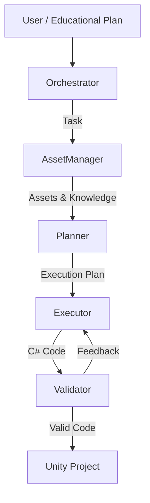

<div align="center">
  

  # Xage 🌌

  
  
  
    
  <p>
    <strong>Xage</strong> (XR Agentic Generation Engine) is an autonomous multi-agent system designed to accelerate XR development. It acts as an **AI-powered XR Developer**, capable of taking a high-level "Educational Plan" and turning it into functional, validated C# code for Unity.
    By orchestrating a team of specialized AI agents, Xage automates the tedious parts of XR content creation—from asset retrieval to logic implementation—allowing creators to focus on the experience itself.
  </p>

</div>


---

## 🚀 Features

- **🤖 Multi-Agent Architecture**: A coordinated team of agents (Orchestrator, Planner, Executor, Asset Manager) working in tandem.
- **🧠 Context-Aware Generation**: Uses a Knowledge Graph (Neo4j) to understand interaction rules and best practices.
- **📦 Asset Integration**: Automatically searches and retrieves 3D assets from Sketchfab.
- **🎮 Unity Bridge**: Generates, compiles, and validates C# scripts directly for Unity projects.
- **📝 Educational Plan Parsing**: Converts structured pedagogical requirements into executable technical tasks.
- **🛡️ Code Validation**: Includes a Roslyn-based validator to ensure generated code is syntactically correct and follows project conventions.

---

## 🏗️ Architecture

Xage is built on **LangChain** and **LangGraph**, simulating a software development team:



### The Agents
1.  **Orchestrator**: The project manager. It parses the Educational Plan, tracks progress, and assigns tasks.
2.  **Asset Manager**: The resource gatherer. It queries **Neo4j** for implementation details and searches **Sketchfab** for 3D models.
3.  **Planner**: The architect. It creates a step-by-step technical execution plan based on the task and available assets.
4.  **Executor**: The coder. It writes the actual C# Unity scripts.
5.  **Validator**: The QA. It checks the code for errors using a custom Roslyn tool and requests fixes if needed.

---

## 🛠️ Getting Started

### Prerequisites
- **Python 3.11+**
- **Conda** (Miniconda or Anaconda) — recommended for environment management
- **Ollama**: For local LLM inference (e.g., `llama3.1`).
- **Unity**: To see the generated scripts in action.

### Installation

1.  **Clone the repository:**
    ```bash
    git clone https://github.com/yourusername/Xage.git
    cd Xage
    ```

2.  **Create a Conda environment (recommended):**
    ```bash
    # Create and activate an environment with Python 3.11
    conda create -n xage python=3.11 -y
    conda activate xage
    ```

3.  **Install dependencies:**
    ```bash
    pip install -r requirements.txt
    ```

4.  **Set up configuration:**
    
    Rename `.env.example` to `.env` and fill in your keys:
    ```ini
    # LLM Provider Configuration
    LLM_PROVIDER=ollama
    ORCHESTRATOR_MODEL=llama3.1
    PLANNER_MODEL=llama3.1
    EXECUTOR_MODEL=llama3.1
    VALIDATOR_MODEL=llama3.1

    # Ollama Configuration
    OLLAMA_BASE_URL=http://localhost:11434
    
    # Sketchfab (Required for Asset Manager)
    SKETCHFAB_TOKEN=your_sketchfab_token
    SKETCHFAB_BASE_URL=https://api.sketchfab.com/v3
    
    # Unity Integration
    UNITY_PROJECT_PATH=/path/to/your/UnityProject
    UNITY_SCRIPTS_PATH=/path/to/Scripts/folder
    ```

---

## 🏃 Usage

### 1. Run the System
To run the agentic workflow which processes a sample Educational Plan:
```bash
python main.py
```

### 2.Debugging and Logs

If you encounter issues or want to inspect the agents' reasoning, check the `artifacts/agent_outputs/` directory. It contains:
- `*_raw.txt`: The full, unparsed responses from the LLMs.
- `*_output.json`: The structured data passed between agents.

---

## 📂 Project Structure

```
Xage/
├── artifacts/          # Outputs (generated code, logs, downloaded assets)
├── src/
│   ├── agents/         # Agent definitions (Orchestrator, Executor, etc.)
│   ├── core/           # Core logic (LLM wrappers, Memory)
│   ├── tools/          # Integrations (Unity, Sketchfab)
│   ├── utils/          # Utility functions
│   └── ...
├── tests/              # Unit and integration tests
├── main.py             # Main entry point for the workflow
├── requirements.txt    # Python dependencies
└── README.md           # This file
```

## 🤝 Contributing

Contributions are welcome! Please feel free to submit a Pull Request.

## License
This project is licensed under the GNU General Public License v3.0 License - see the [LICENSE](https://github.com/master-ti-rax/xage/blob/main/LICENSE.md) file for details.

## Contact
For any questions or support, please reach out to:
- University of Cagliari: mirko.marras@unica.it, diego.reforgiato@unica.it, daniele.riboni@unica.it, andreag.martis@unica.it
- R2M Solution: giuseppe.scarpi@r2msolution.com