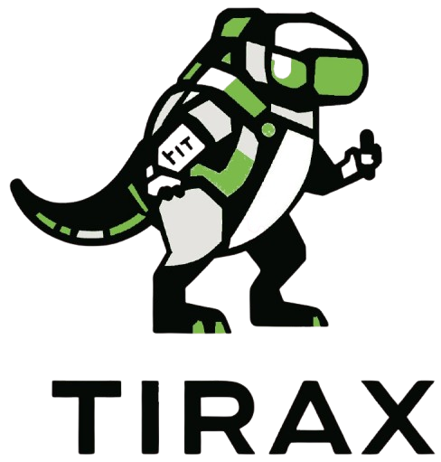
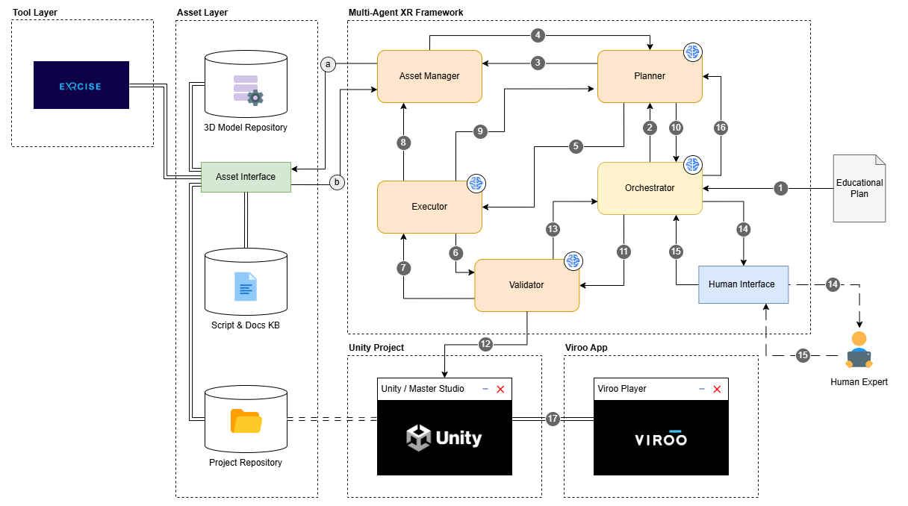

<div align="center">
  

  # Xage 🌌

  
  
  
  

  <p>
    <strong>Xage</strong> (XR Agentic Generation Engine) is an autonomous multi-agent system that transforms structured <strong>Educational Plans</strong> into functional, validated C# Unity scripts for XR training scenarios. It orchestrates a team of specialized AI agents to automate the full pipeline — from parsing pedagogical specifications (PDF or JSON) and retrieving 3D assets to generating runtime C# code and validating it with Roslyn compilation.
  </p>

</div>

---

## 🔭 Overview

Xage takes an **Educational Plan** — a structured document describing XR training modules, learning flows, interactions, and required assets — and autonomously produces Unity C# scripts that implement the described scenario at runtime. Educational Plans can be provided as **PDF files** (automatically parsed) or pre-structured **JSON files**.

The system is designed for **industrial XR training** use cases (e.g., human-robot collaboration, battery inspection, safety training) where educational designers write detailed pedagogical specifications and the system handles the technical implementation.

### What Xage Does

1. **Parses** an Educational Plan (PDF or JSON) into a granular, hierarchical structure — extracting metadata, learning objectives, classification, modules with individual steps, operational parameters, and required 3D assets
2. **Orchestrates** the execution by identifying the next incomplete task from the plan
3. **Plans** the implementation by decomposing tasks into atomic C# scripting steps with asset and knowledge requirements
4. **Retrieves** 3D models from local directories or the Sketchfab API, and documentation from knowledge sources
5. **Generates** complete C# Unity scripts using template functions and the XR Interaction Toolkit
6. **Validates** generated code via Roslyn compilation and semantic correctness checks
7. **Iterates** with feedback loops — the Validator can send code back to the Executor for refinement

---

## 🚀 Features

- **🤖 Multi-Agent Workflow**: Five coordinated agents (Orchestrator, Planner, Asset Manager, Executor, Validator) connected via a LangGraph state machine
- **📑 PDF Educational Plan Parsing**: Automatically extracts structured data from PDF educational plans — metadata, learning objectives, ISCED/ESCO classification, training modules with step-by-step flows, operational parameters, and 3D asset requirements
- **🧠 Template-Driven Code Generation**: Agents leverage existing C# template functions to produce consistent, reusable Unity code rather than generating everything from scratch
- **📦 3D Asset Pipeline**: Two-stage retrieval — local directory search with semantic embeddings, then Sketchfab API fallback with automatic download and embedding indexing
- **🛡️ Roslyn Code Validation**: A standalone .NET tool compiles generated C# code and returns structured diagnostics (errors, warnings) that feed back into the agent loop
- **🔌 Multi-Provider LLM Support**: Pluggable LLM backends — Ollama (local), OpenAI, Google Gemini, and Anthropic Claude — configurable per-agent via environment variables
- **🔀 Event-Driven Routing**: History-based state machine routing where each agent's output event determines the next node — enabling flexible cycles without hardcoded transitions
- **🔄 Incremental Implementation**: Tasks are executed step-by-step with cumulative code modification, allowing progressive scene construction

---

## 🏗️ Architecture

Xage is built on **LangChain** (v1.0+) and **LangGraph**, implementing a cyclic state machine where agents communicate through a shared `WorkflowState`.

<div align="center">
  
</div>

### Agents

| Agent | Role | Key Responsibilities |
|-------|------|---------------------|
| **Orchestrator** | Project Manager | Receives the parsed Educational Plan, determines the next incomplete task, tracks overall progress across modules |
| **Planner** | Technical Lead | Decomposes tasks into atomic implementation steps, maps steps to template functions, identifies required assets and knowledge, routes between Asset Manager and Executor |
| **Asset Manager** | Resource Gatherer | Retrieves 3D models (local search + Sketchfab API), documentation, and knowledge graph data based on Planner's asset requests |
| **Executor** | C# Developer | Writes complete Unity C# scripts using template functions, existing code, retrieved assets, and optionally validation feedback for refinement |
| **Validator** | QA Engineer | Validates generated code via Roslyn compilation diagnostics, checks template usage, verifies semantic correctness against step requirements |

### Routing Logic

All routing is event-driven via a history-based state machine. Each agent appends a descriptive event string to the workflow history, and a central `route()` function maps the latest event to the next node:

| Event | Next Node |
|-------|-----------|
| `Orchestrator returned the educational task` | Planner |
| `Planner requested assets from Asset Manager` | Asset Manager |
| `Asset Manager returned resources to Planner` | Planner |
| `Planner sent implementation step to Executor` | Executor |
| `Executor generated code for the implementation step` | Validator |
| `Validator reported validation result to Executor` | Executor |
| `Executor confirmed implementation completion` | Planner |
| `Planner determined all implementation steps are complete` | END |

---

## 📄 Educational Plan Format

Educational Plans describe XR training scenarios with full pedagogical structure. The system accepts **PDF files** (parsed automatically) or **JSON files**.

### PDF Input

Place PDF educational plans in the `assets/` directory. The parser (`src/tools/pdf_parser.py`) extracts the following hierarchical structure using `pdfplumber`:

- **Metadata**: title, language, short/long description, keywords, expected workload, type of participation, target audience, EQF level
- **Learning Objectives**: bullet-point list of competency goals
- **Classification**: ISCED-F subject area codes and ESCO competence URIs
- **Completion Criteria**: supervision requirements and assessment thresholds
- **Detailed Learning Design**:
  - Role of the Robot (traditional vs. robot-assisted inspection)
  - Operational Parameters (inspection modes, cycle durations, handling bins, control console layout with process menu and status panel including KPI dashboard)
  - Training Script overview
- **Modules** (1–6, each with):
  - Module ID, title, duration
  - Pedagogical rationale
  - Learning outcomes
  - Learning flow with numbered steps (each with `step_id`, `step_number`, `title`, `description`)
  - Learner monitoring criteria
- **Required 3D Assets**: categorized by environment, robot system, batteries, safety props, human equipment, and interaction props

### JSON Input

Pre-structured JSON files follow the same schema. See `assets/ed_plan.json` for a reference example.

---

## 🛠️ Getting Started

### Prerequisites

- **Python 3.11+**
- **Conda** (Miniconda or Anaconda) — recommended
- **An LLM provider** — one of:
  - [Ollama](https://ollama.ai/) for local inference
  - OpenAI, Google Gemini, or Anthropic API key for cloud inference
- **.NET 8.0 SDK** — required for the Roslyn C# validator
- **Unity** (optional) — to deploy and run the generated scripts

### Installation

1.  **Clone the repository:**
    ```bash
    git clone https://github.com/master-ti-rax/xage.git
    cd xage
    ```

2.  **Create a Conda environment:**
    ```bash
    conda create -n xage python=3.11 -y
    conda activate xage
    ```

3.  **Install Python dependencies:**
    ```bash
    pip install -r requirements.txt
    ```

4.  **Build the Roslyn Validator:**
    ```bash
    cd src/tools/RoslynValidator
    dotnet build
    cd ../../..
    ```

5.  **Configure environment variables:**

    Create a `.env` file in the project root:
    ```ini
    # LLM Provider (ollama | openai)
    LLM_PROVIDER=ollama

    # Per-agent model selection
    ORCHESTRATOR_MODEL=llama3.1
    PLANNER_MODEL=llama3.1
    EXECUTOR_MODEL=llama3.1
    VALIDATOR_MODEL=llama3.1

    # Ollama (if using local inference)
    OLLAMA_BASE_URL=http://localhost:11434

    # OpenAI (if using cloud inference)
    # OPENAI_API_KEY=your_openai_api_key

    # Sketchfab (for 3D asset retrieval)
    SKETCHFAB_TOKEN=your_sketchfab_token
    SKETCHFAB_BASE_URL=https://api.sketchfab.com/v3

    # 3D Models local directory
    3D_MODELS_PATH=/path/to/local/3d/models

    # Unity Integration
    UNITY_PROJECT_PATH=/path/to/your/UnityProject
    UNITY_SCRIPTS_PATH=/path/to/Scripts/folder
    UNITY_VERSION=2022.3
    UNITY_XR_FRAMEWORK=XR Interaction Toolkit (XRIT)

    # Workflow
    GRAPH_RECURSION_LIMIT=50
    ```

---

## 🏃 Usage

### Running the Workflow

```bash
# Run with a PDF educational plan (automatically parsed)
python main.py assets/001_sorting_wasted_automotive_batteries.pdf

# Enable debug output
python main.py assets/001_sorting_wasted_automotive_batteries.pdf --debug
```

### Inspecting Agent Outputs

All intermediate agent outputs are saved to `artifacts/agent_outputs/`:

| File | Content |
|------|---------|
| `orchestrator_output.json` | Current task assignment from the Educational Plan |
| `planner_output.json` | Structured implementation plan with steps, assets, and knowledge |
| `asset_manager_output.json` | Retrieved 3D models and documentation |
| `executor_output.cs` | Generated C# Unity script |
| `validator_output.json` | Validation result with checks, diagnostics, and reasoning |
| `*_raw.txt` | Full unparsed LLM responses for debugging |

---

## 📁 Project Structure

```
xage/
├── main.py                         # CLI entry point — loads plan (PDF/JSON) and runs workflow
├── requirements.txt                # Python dependencies
├── assets/
│   ├── 001_sorting_wasted_*.pdf    # Sample Educational Plan (PDF)
│   ├── ed_plan.json                # Sample Educational Plan (JSON)
│   └── img/                        # Documentation images
├── artifacts/
│   └── agent_outputs/              # Generated code, plans, and debug logs
├── src/
│   ├── graph.py                    # LangGraph workflow — state machine, nodes, routing
│   ├── state.py                    # ExecutionState dataclass
│   ├── config.py                   # GraphConfig (recursion limits, etc.)
│   ├── agents/
│   │   ├── orchestrator.py         # Parses EP, assigns next task
│   │   ├── planner.py              # Creates implementation plans
│   │   ├── executor.py             # Generates C# Unity code
│   │   ├── asset_manager.py        # Retrieves 3D models and knowledge
│   │   └── validator.py            # Validates code with Roslyn + semantic checks
│   ├── core/
│   │   ├── agent.py                # BaseAgent wrapper around LangChain agent executor
│   │   ├── llm.py                  # LLM provider abstraction (Ollama, OpenAI, Gemini, Claude)
│   │   └── memory.py              # Agent memory (placeholder)
│   ├── prompts/                    # System and input prompts for each agent
│   ├── tools/
│   │   ├── pdf_parser.py           # PDF educational plan parser (pdfplumber)
│   │   ├── langchain_tools.py      # Tool definitions (C# validation, Sketchfab, Unity)
│   │   ├── sketchfab_tools.py      # Sketchfab API client
│   │   ├── unity_comms.py          # Unity WebSocket bridge (message queue)
│   │   ├── git_tools.py            # Git operations
│   │   ├── neo4j_tools.py          # Knowledge graph integration (placeholder)
│   │   └── RoslynValidator/        # .NET project for C# compilation diagnostics
│   └── utils/
│       ├── cleaning.py             # Output parsing (JSON extraction, C# cleanup)
│       ├── saving.py               # Artifact persistence
│       └── templates.py            # C# template function extraction from Unity scripts
├── tests/                          # Unit and integration tests
│   ├── test_pdf_parser.py          # PDF parser tests (31 tests)
│   ├── test_agents.py              # Agent unit tests
│   ├── test_graph.py               # Workflow graph tests
│   ├── test_orchestrator_tools.py  # Orchestrator tool tests
│   ├── test_roslyn_validator.py    # Roslyn validator tests
│   ├── test_templates.py           # Template extraction tests
│   └── test_tools.py               # Tool integration tests
└── data/
    └── local_db/                   # Local data storage
```

---

## 🧪 Testing

```bash
# Run all tests
pytest tests/ -v

# Run PDF parser tests only
pytest tests/test_pdf_parser.py -v
```

---

## 🤝 Contributing

Contributions are welcome. Please submit a Pull Request with a clear description of the change.

## 📜 License

This project is licensed under the GNU General Public License v3.0 — see the [LICENSE](https://github.com/master-ti-rax/xage/blob/main/LICENSE.md) file for details.

## 📬 Contact

- **University of Cagliari**: mirko.marras@unica.it, diego.reforgiato@unica.it, daniele.riboni@unica.it, andreag.martis@unica.it
- **R2M Solution**: giuseppe.scarpi@r2msolution.com